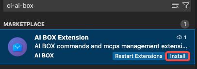

# AIBOX Extension
### 概述
一个 VSCode 扩展，用于管理Cursor Commands、MCP和Rules。

## 功能特性

### AIBOX 管理
- ✅ 底部状态栏显示AIBOX按钮
- ✅ 点击按钮打开管理面板
- ✅ Commands、MCPs和Rules三个Tab页
- ✅ 从后端 API 获取数据
- ✅ 一键使用 Command、MCP和Rule
- ✅ 自动按 level（team/user/project）分类查询

### Cursor & Commands 快捷操作 🆕
- ✅ 一键打开 User Commands 目录
- ✅ 一键打开 Project Commands 目录
- ✅ 自动创建目录和示例文件
- ✅ 直接编辑，简单高效

## 安装
### 方式一：Marketplace安装（推荐）
搜索 <b>AIBOX Extension</b>或<b>ci-ai-box</b>
找到AIBOX点击install按钮安装如图


### 方式二：直接安装

如果已有打包好的 `.vsix` 文件：

```bash
code --install-extension ai-ci-extension-0.0.1.vsix
```

或通过 VSCode 界面：
1. 按 `Cmd+Shift+P` / `Ctrl+Shift+P`
2. 输入 "Install from VSIX"
3. 选择 `.vsix` 文件


## 使用方法

### AI-CI 管理面板

1. **打开面板**
   - 点击 VSCode 底部状态栏右侧的 "AI-CI" 按钮
   - 或使用命令面板（Ctrl+Shift+P / Cmd+Shift+P）执行 "Open AI-CI Panel"

2. **查看 Commands**
   - 默认显示 Commands Tab
   - 列表显示所有可用的 commands，包括名称和 level

3. **筛选查询**
   - 在 Name 输入框输入关键字搜索
   - 在 Level 下拉框选择范围（All/Team/User/Project）
   - 点击 🔍 Search 按钮或按 Enter 键执行搜索
   - 点击 Reset 按钮清空筛选条件

4. **查看 MCP 市场**
   - 点击 "MCP" Tab
   - 列表显示所有可用的 MCP
   - 同样支持筛选查询功能


